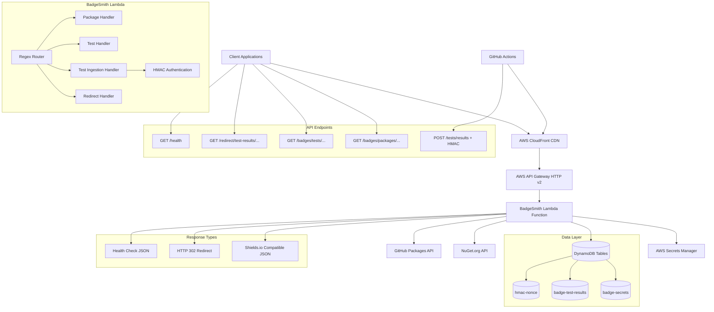

# 📋 Project Overview

*Last Updated: August 20, 2025*

## 🎯 Project Vision

BadgeSmith is a **high-performance .NET 8 Native AOT badge service** that provides Shields.io-compatible endpoints for package metadata and test results. It represents a strategic migration from JavaScript to .NET, designed for maximum performance, minimal cold start times, and seamless AWS Lambda deployment.

## 🏗️ High-Level Architecture

### Core Components

- **🌍 CloudFront CDN**: Edge caching for global performance and cost optimization
- **🚦 Hybrid Router**: Source-generated regex + routing table for optimal performance
- **📦 Package Services**: NuGet and GitHub package metadata retrieval
- **🧪 Test Integration**: GitHub test result ingestion and badge generation
- **🔐 HMAC Authentication**: Secure API access with replay protection and nonce validation
- **↩️ Redirect Service**: HTTP 302 redirects to latest test run URLs
- **📋 Shields.io JSON**: Returns badge.io-compatible JSON responses (no SVG generation)

## 🎯 Key Goals

### Performance

- **Sub-100ms cold starts** with Native AOT compilation
- **Single-digit millisecond** response times for cached badges
- **Minimal memory footprint** for cost-effective Lambda execution

### Compatibility

- **100% Shields.io compatibility** for existing badge URLs
- **Drop-in replacement** for current JavaScript implementation
- **Backward-compatible** API endpoints and response formats

### Maintainability

- **Modern C# patterns** with record types and pattern matching
- **Comprehensive testing** with unit, integration, and performance tests
- **Clear separation of concerns** with dedicated handler classes

## 🔄 Migration Strategy

### Phase Approach

1. **🌱 Foundation** - Core infrastructure and routing
2. **🔗 API Endpoints** - Package and test endpoint implementation
3. **🎨 Response Formatting** - Shields.io JSON responses and caching
4. **🔒 Authentication** - Security layer implementation
5. **📊 Monitoring** - Observability and performance optimization
6. **🚀 Migration** - Production deployment and traffic switching

### Risk Mitigation

- **Parallel development** alongside existing JavaScript service
- **Feature flags** for gradual rollout
- **Comprehensive testing** before traffic migration
- **Rollback capabilities** at every deployment stage

## 🛠️ Technology Stack

### Runtime & Platform

- **.NET 8** with Native AOT compilation
- **AWS Lambda** with API Gateway integration
- **LocalStack** for local development and testing

### Storage & Caching

- **DynamoDB** for package metadata and test results
- **In-memory caching** for frequently accessed badges
- **S3** for large test result payloads (future enhancement)

### Development Tools

- **Aspire** for local orchestration and service discovery
- **AWS CDK** for infrastructure as code
- **xUnit** for testing framework
- **GitHub Actions** for CI/CD pipeline

## 📊 Success Metrics

### Performance Targets

- **Cold start**: < 100ms (vs ~300ms JavaScript)
- **Warm response**: < 10ms for cached badges
- **Memory usage**: < 64MB per execution
- **Cost reduction**: 40%+ vs current implementation

### Quality Targets

- **Test coverage**: > 90% for core business logic
- **Error rate**: < 0.1% for production traffic
- **Uptime**: 99.9% availability SLA
- **Security**: Zero authentication bypasses

## 🔗 Related Documentation

- **[Requirements](02-requirements.md)** - Detailed technical and business requirements
- **[Migration Strategy](03-migration-strategy.md)** - Step-by-step migration approach
- **[System Architecture](../02-architecture/01-system-architecture.md)** - Detailed technical design
- **[Phase 1 Foundation](../03-implementation/Phase-1-foundation.md)** - Implementation starting point
