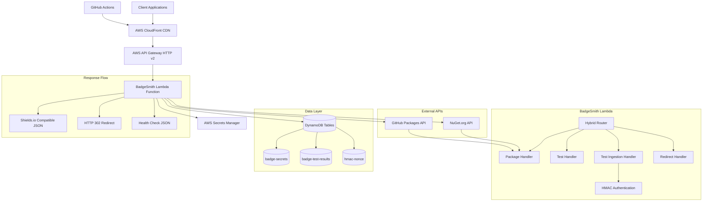

# 🗺️ System Architecture

> **Last Updated**: August 20, 2025

## 🎯 Architecture Overview

BadgeSmith is built as a **serverless-first, performance-optimized** badge service using modern .NET 8 Native AOT technology. The architecture prioritizes sub-100ms cold starts, global performance via CloudFront CDN, and enterprise-grade security.

## 🏗️ High-Level System Architecture



## 📊 Technology Stack

### Core Platform

| Component | Technology | Rationale |
|-----------|------------|-----------|
| **Runtime** | .NET 8 Native AOT | Fast cold starts (< 100ms), small deployment size |
| **Hosting** | AWS Lambda | Serverless, pay-per-use, auto-scaling |
| **API Gateway** | AWS API Gateway HTTP v2 | Modern, efficient HTTP API with built-in CORS |
| **CDN** | AWS CloudFront | Global edge caching, performance optimization |
| **Data Storage** | Amazon DynamoDB | NoSQL, serverless, read-optimized with GSI |
| **Secrets** | AWS Secrets Manager | Secure credential management and rotation |
| **Infrastructure** | AWS CDK .NET | Infrastructure as Code, type-safe resource definitions |

### Development & Operations

| Component | Technology | Rationale |
|-----------|------------|-----------|
| **Local Development** | LocalStack + .NET Aspire | Full AWS service emulation with orchestration |
| **Lambda Emulation** | AWS Aspire Lambda Integration | Native Lambda and API Gateway development |
| **Caching** | In-Memory + Future Redis | Performance optimization with TTL strategies |
| **Monitoring** | CloudWatch + Structured Logging | Comprehensive observability and alerting |
| **CI/CD** | GitHub Actions | Automated testing, building, and deployment |

## 🏛️ Component Architecture

### Lambda Function Design

#### Entry Point & Routing

```csharp
// Function.cs - Lambda entry point
public class Function
{
    private static readonly ServiceProvider ServiceProvider = CreateServiceProvider();

    public async Task<APIGatewayHttpApiV2ProxyResponse> FunctionHandler(
        APIGatewayHttpApiV2ProxyRequest request,
        ILambdaContext context)
    {
        return await Router.HandleAsync(request, context, ServiceProvider);
    }
}

// Router.cs - Hybrid routing with source-generated regex
public static partial class RouteTable
{
    [GeneratedRegex(@"^/badges/packages/(?<provider>nuget|github)/(?<package>[^/]+)$")]
    private static partial Regex PackageBadgeRegex();

    [GeneratedRegex(@"^/tests/results$")]
    private static partial Regex TestIngestionRegex();

    private static readonly RouteEntry[] Routes = [
        new("/badges/packages/{provider}/{package}", PackageBadgeRegex(), typeof(PackageBadgeHandler), "GET", RequiresAuth: false),
        new("/tests/results", TestIngestionRegex(), typeof(TestIngestionHandler), "POST", RequiresAuth: true),
        // ... more routes
    ];
}
```

#### Handler Architecture

```csharp
// Handler interface for consistency
public interface IRouteHandler
{
    Task<APIGatewayHttpApiV2ProxyResponse> HandleAsync(
        RouteContext context,
        CancellationToken cancellationToken = default);
}

// Route context with all necessary data
public record RouteContext(
    APIGatewayHttpApiV2ProxyRequest Request,
    ILambdaContext LambdaContext,
    Match RouteMatch,
    IServiceProvider Services);

// Example handler implementation
public class PackageBadgeHandler : IRouteHandler
{
    private readonly IPackageProviderFactory _providerFactory;
    private readonly ICacheService _cache;

    public async Task<APIGatewayHttpApiV2ProxyResponse> HandleAsync(
        RouteContext context, CancellationToken cancellationToken = default)
    {
        var provider = context.RouteMatch.Groups["provider"].Value;
        var package = context.RouteMatch.Groups["package"].Value;

        // Business logic implementation
        var packageInfo = await GetPackageInfoWithCache(provider, package, cancellationToken);
        return CreateShieldsBadgeResponse(packageInfo);
    }
}
```

### Data Architecture

#### DynamoDB Table Design

**Table 1: Secrets Mapping (`badge-secrets`)**

```json
{
  "PK": "SECRET#github#localstack-dotnet#localstack.client",
  "SK": "META",
  "SecretId": "arn:aws:secretsmanager:eu-central-1:123:secret:github-token-abc123",
  "Provider": "github",
  "Org": "localstack-dotnet",
  "Package": "localstack.client",
  "CreatedAt": "2025-01-15T10:30:00Z",
  "TTL": 1735689000
}
```

**Access Pattern**: Get secret by provider/org/package: `PK = SECRET#{provider}#{org}#{package}`

**Table 2: Test Results (`badge-test-results`)**

```json
{
  "PK": "TEST#localstack-dotnet#dotnet-aspire-for-localstack",
  "SK": "RESULT#linux#main#2025-01-15T10:30:00Z",

  "Platform": "linux",
  "Branch": "main",
  "Passed": 190,
  "Failed": 0,
  "Skipped": 0,
  "Total": 190,
  "Timestamp": "2025-01-15T10:30:00Z",

  "UrlHtml": "https://github.com/owner/repo/runs/123",
  "WorkflowRunUrl": "https://github.com/owner/repo/actions/runs/456",
  "Commit": "4d8474bda0b16fbbb69887d0d08c3885843bbdc7",
  "RunId": "16814735762",

  "GSI1PK": "LATEST#localstack-dotnet#dotnet-aspire-for-localstack#linux#main",
  "GSI1SK": "2025-01-15T10:30:00Z",

  "TTL": 1735689000
}
```

**Global Secondary Index (GSI1):**

- **PK**: `LATEST#{owner}#{repo}#{platform}#{branch}`
- **SK**: `timestamp`
- **Purpose**: Efficient "latest result" queries

**Access Patterns:**

1. Get all results for repo: `PK = TEST#{owner}#{repo}`
2. Get latest result: Query GSI1 with `PK = LATEST#{owner}#{repo}#{platform}#{branch}`, sort by SK DESC, limit 1
3. Get results by time range: Query main table with SK condition

**Table 3: HMAC Nonce Storage (`hmac-nonce`)**

```json
{
  "PK": "NONCE#{nonce-value}",
  "SK": "META",
  "Timestamp": "2025-01-15T10:30:00Z",
  "RepoId": "localstack-dotnet/dotnet-aspire-for-localstack",
  "TTL": 1735689000
}
```

**Purpose**: Replay protection for HMAC authentication with 45-minute TTL

### Caching Strategy

#### Multi-Level Caching Architecture

```csharp
public class CacheService : ICacheService
{
    private readonly MemoryCache _memoryCache;
    private readonly IDistributedCache? _distributedCache; // Future Redis integration

    // Cache key patterns with optimized TTL
    private static readonly Dictionary<string, TimeSpan> CacheTtl = new()
    {
        ["secret:{provider}:{org}:{package}"] = TimeSpan.FromHours(1),      // Secrets Manager calls are costly
        ["test:{owner}:{repo}:{platform}:{branch}"] = TimeSpan.FromMinutes(5),  // Balance freshness vs performance
        ["package:{provider}:{org}:{package}:{filters-hash}"] = TimeSpan.FromMinutes(15), // NuGet API calls are expensive
        ["nonce:{nonce-value}"] = TimeSpan.FromMinutes(45)                   // Replay protection window (cost-optimized)
    };
}
```

#### Cache Strategies by Endpoint Type

| Endpoint Type | Cache Location | TTL | Strategy |
|---------------|----------------|-----|----------|
| **Package Badges** | CloudFront + In-Memory | 2 minutes | Stale-while-revalidate |
| **Test Badges** | CloudFront + In-Memory | 30 seconds | Fresh data priority |
| **Secrets** | In-Memory only | 1 hour | Security-sensitive |
| **HMAC Nonces** | DynamoDB | 45 minutes | Replay protection |

### Security Architecture

#### HMAC Authentication Flow

```csharp
public class HmacAuthService
{
    public async Task<AuthResult> ValidateRequestAsync(
        string signature,        // X-Signature header
        string repoSecret,      // X-Repo-Secret header
        string payload,         // Request body
        CancellationToken cancellationToken = default)
    {
        // 1. Extract and validate timestamp (5-minute window)
        var timestamp = ExtractTimestamp(payload);
        if (!IsTimestampValid(timestamp))
            return AuthResult.Failure("Request timestamp outside valid window");

        // 2. Extract nonce and check for replay
        var nonce = ExtractNonce(payload);
        if (await IsNonceUsed(nonce, cancellationToken))
            return AuthResult.Failure("Nonce already used - replay attack detected");

        // 3. Retrieve HMAC secret from Secrets Manager
        var secret = await _secretsService.GetSecretAsync($"badge/repo/{repoSecret}");
        if (secret == null)
            return AuthResult.Failure("Invalid repository secret");

        // 4. Validate HMAC signature
        var computedSignature = ComputeHmacSha256(payload, secret);
        if (!signature.Equals($"sha256={computedSignature}", StringComparison.Ordinal))
            return AuthResult.Failure("Invalid HMAC signature");

        // 5. Store nonce with 45-minute TTL for replay prevention
        await StoreNonce(nonce, repoSecret, cancellationToken);

        return AuthResult.Success();
    }
}
```

#### Secrets Management Structure

```json
{
  "secretName": "badge/github/localstack-dotnet",
  "secretValue": {
    "token": "ghp_xxxxxxxxxxxxxxxxxxxx",
    "type": "github_pat"
  }
}

{
  "secretName": "badge/repo/localstack-dotnet/dotnet-aspire-for-localstack",
  "secretValue": {
    "hmac_key": "base64-encoded-secret",
    "type": "repo_hmac"
  }
}
```

### External Integrations

#### Package Provider Architecture

```csharp
public interface IPackageProvider
{
    Task<Result<PackageInfo>> GetLatestVersionAsync(
        string? org,
        string package,
        VersionFilters filters,
        CancellationToken cancellationToken = default);
}

// NuGet provider with resilience patterns
public class NuGetProvider : IPackageProvider
{
    private readonly HttpClient _httpClient;
    private readonly ICacheService _cache;

    public async Task<Result<PackageInfo>> GetLatestVersionAsync(
        string? org, string package, VersionFilters filters, CancellationToken cancellationToken = default)
    {
        var cacheKey = $"package:nuget::{package}:{filters.GetHashCode()}";

        // Try cache first
        if (_cache.TryGet<PackageInfo>(cacheKey, out var cached))
            return Result.Success(cached);

        try
        {
            // Call NuGet API with conditional requests (ETag)
            var response = await _httpClient.GetAsync($"v3-flatcontainer/{package}/index.json", cancellationToken);

            if (response.IsSuccessStatusCode)
            {
                var packageInfo = await ParseNuGetResponse(response, filters);
                await _cache.SetAsync(cacheKey, packageInfo, TimeSpan.FromMinutes(15), cancellationToken);
                return Result.Success(packageInfo);
            }

            return Result.Failure("Package not found", 404);
        }
        catch (Exception ex)
        {
            // Graceful degradation - return cached data if available
            if (_cache.TryGet<PackageInfo>(cacheKey, out var staleCache))
                return Result.Success(staleCache);

            return Result.Failure($"Service unavailable: {ex.Message}", 503);
        }
    }
}
```

#### Resilience Patterns

```csharp
public class ResilienceService
{
    public async Task<Result<T>> ExecuteWithResilienceAsync<T>(
        Func<CancellationToken, Task<T>> operation,
        CancellationToken cancellationToken = default)
    {
        // Exponential backoff retry policy
        var retryPolicy = Policy
            .Handle<HttpRequestException>()
            .Or<TaskCanceledException>()
            .WaitAndRetryAsync(
                retryCount: 3,
                sleepDurationProvider: retryAttempt => TimeSpan.FromSeconds(Math.Pow(2, retryAttempt)),
                onRetry: (outcome, timespan, retryCount, context) =>
                {
                    _logger.LogWarning("Retry {RetryCount} after {Delay}ms", retryCount, timespan.TotalMilliseconds);
                });

        // Circuit breaker pattern
        var circuitBreakerPolicy = Policy
            .Handle<HttpRequestException>()
            .CircuitBreakerAsync(
                handledEventsAllowedBeforeBreaking: 3,
                durationOfBreak: TimeSpan.FromMinutes(1));

        var combinedPolicy = Policy.WrapAsync(retryPolicy, circuitBreakerPolicy);

        try
        {
            var result = await combinedPolicy.ExecuteAsync(async () => await operation(cancellationToken));
            return Result.Success(result);
        }
        catch (Exception ex)
        {
            return Result.Failure(ex.Message);
        }
    }
}
```

## 🚀 Performance Architecture

### Response Time Optimization

| Component | Optimization | Target |
|-----------|--------------|--------|
| **Cold Start** | Native AOT compilation | < 100ms |
| **Warm Response** | In-memory caching | < 10ms |
| **Package Lookup** | ETag conditional requests | < 50ms |
| **Test Badge** | GSI optimized queries | < 5ms |
| **CloudFront Cache** | Edge caching | < 200ms globally |

### Memory Management

```csharp
// Efficient memory usage patterns for Lambda
public static class ResponseHelper
{
    private static readonly JsonSerializerOptions JsonOptions = new(JsonSerializerDefaults.Web)
    {
        TypeInfoResolver = LambdaFunctionJsonSerializerContext.Default
    };

    public static APIGatewayHttpApiV2ProxyResponse CreateBadgeResponse(ShieldsBadgeResponse badge)
    {
        // Pre-allocated response structure
        return new APIGatewayHttpApiV2ProxyResponse
        {
            StatusCode = 200,
            Headers = new Dictionary<string, string>
            {
                ["Content-Type"] = "application/json",
                ["Cache-Control"] = "public, max-age=120, s-maxage=120",
                ["Access-Control-Allow-Origin"] = "*"
            },
            Body = JsonSerializer.Serialize(badge, JsonOptions)
        };
    }
}
```

### Scalability Design

- **Stateless Architecture**: No shared state between Lambda invocations
- **Auto-scaling**: Lambda automatically handles concurrent executions
- **DynamoDB On-Demand**: Scales with traffic patterns automatically
- **CloudFront Global**: Handles traffic spikes via edge caching
- **Circuit Breakers**: Protect against upstream service failures

## 🔗 Related Documentation

- **[Project Overview](../01-foundation/01-project-overview.md)** - High-level project vision and goals
- **[Requirements](../01-foundation/02-requirements.md)** - Functional and technical requirements
- **[Routing Strategy](02-routing-strategy.md)** - Detailed routing implementation approach
- **[Security Design](03-security-design.md)** - HMAC authentication and security patterns
- **[Phase 1 Foundation](../03-implementation/Phase-1-foundation.md)** - Implementation starting point
