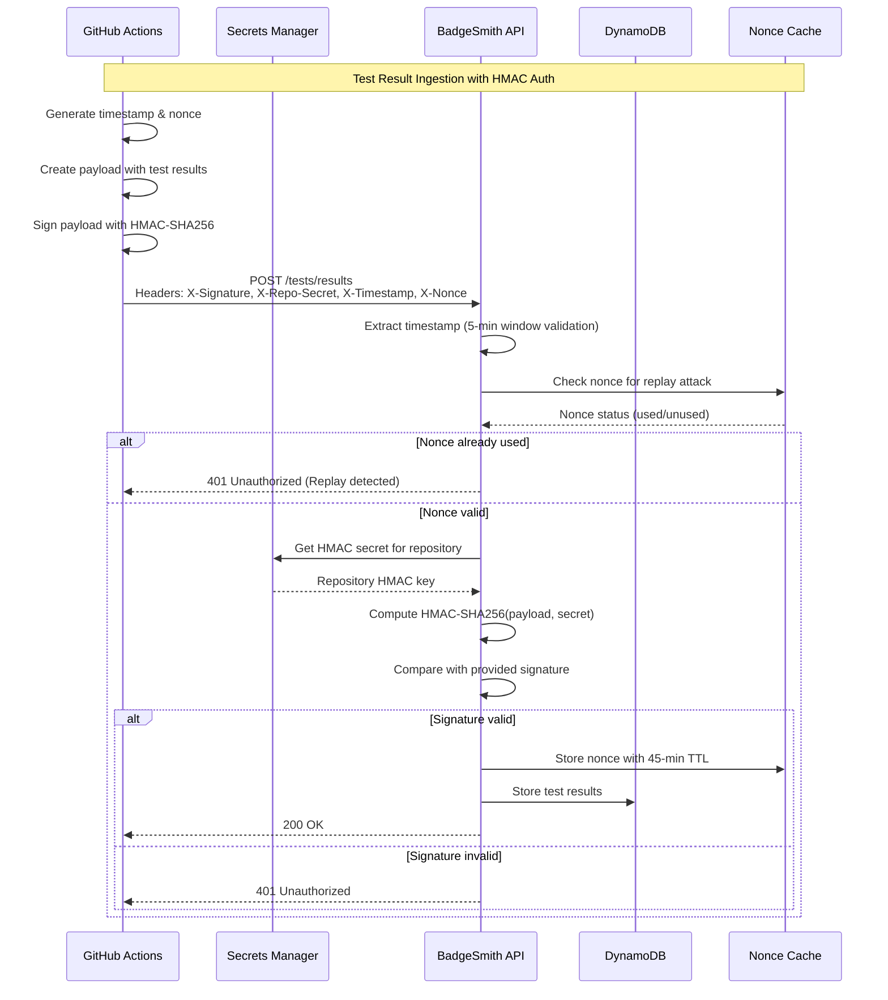

# 🛡️ Security Design

> **Last Updated**: August 20, 2025

## 🎯 Security Overview

BadgeSmith implements **defense-in-depth security** with multiple layers of protection, focusing on HMAC authentication for test result ingestion, comprehensive secrets management, and protection against common web application attacks.

## 🔐 Authentication Architecture

### HMAC-SHA256 Authentication Flow

BadgeSmith uses **HMAC-SHA256** with replay protection for securing test result ingestion endpoints. This provides cryptographic integrity and authenticity verification.



### HMAC Implementation Details

#### Request Headers

All authenticated requests must include these headers:

| Header | Description | Example |
|--------|-------------|---------|
| `X-Signature` | HMAC-SHA256 signature | `sha256=abcd1234...` |
| `X-Repo-Secret` | Repository identifier | `localstack-dotnet/badge-smith` |
| `X-Timestamp` | ISO 8601 timestamp | `2025-01-15T10:30:00Z` |
| `X-Nonce` | Unique request identifier | `550e8400-e29b-41d4-a716-446655440000` |

#### HMAC Signature Generation

```csharp
public class HmacSignatureGenerator
{
    public static string GenerateSignature(string payload, string secretKey)
    {
        var keyBytes = Convert.FromBase64String(secretKey);
        var payloadBytes = Encoding.UTF8.GetBytes(payload);

        using var hmac = new HMACSHA256(keyBytes);
        var hashBytes = hmac.ComputeHash(payloadBytes);
        var hashHex = Convert.ToHexString(hashBytes).ToLowerInvariant();

        return $"sha256={hashHex}";
    }
}
```

#### HMAC Validation Service

```csharp
public class HmacAuthService
{
    private readonly ISecretsService _secretsService;
    private readonly INonceService _nonceService;
    private readonly ILogger<HmacAuthService> _logger;

    public async Task<AuthResult> ValidateRequestAsync(
        string signature,
        string repoSecret,
        string timestamp,
        string nonce,
        string payload,
        CancellationToken cancellationToken = default)
    {
        try
        {
            // 1. Validate timestamp (5-minute window)
            if (!IsTimestampValid(timestamp))
            {
                _logger.LogWarning("Request timestamp outside valid window: {Timestamp}", timestamp);
                return AuthResult.Failure("Request timestamp outside valid window");
            }

            // 2. Check for replay attack using nonce
            if (await _nonceService.IsNonceUsedAsync(nonce, cancellationToken))
            {
                _logger.LogWarning("Nonce already used - replay attack detected: {Nonce}", nonce);
                return AuthResult.Failure("Nonce already used - replay attack detected");
            }

            // 3. Retrieve HMAC secret from Secrets Manager
            var secret = await _secretsService.GetRepositorySecretAsync(repoSecret, cancellationToken);
            if (secret == null)
            {
                _logger.LogWarning("Invalid repository secret: {RepoSecret}", repoSecret);
                return AuthResult.Failure("Invalid repository secret");
            }

            // 4. Validate HMAC signature
            var computedSignature = GenerateSignature(payload, secret);
            if (!signature.Equals(computedSignature, StringComparison.Ordinal))
            {
                _logger.LogWarning("Invalid HMAC signature for repo: {RepoSecret}", repoSecret);
                return AuthResult.Failure("Invalid HMAC signature");
            }

            // 5. Store nonce to prevent replay attacks
            await _nonceService.StoreNonceAsync(nonce, repoSecret, cancellationToken);

            _logger.LogInformation("HMAC authentication successful for repo: {RepoSecret}", repoSecret);
            return AuthResult.Success(repoSecret);
        }
        catch (Exception ex)
        {
            _logger.LogError(ex, "HMAC authentication failed with exception");
            return AuthResult.Failure("Authentication service error");
        }
    }

    private static bool IsTimestampValid(string timestamp)
    {
        if (!DateTime.TryParse(timestamp, out var requestTime))
            return false;

        var now = DateTime.UtcNow;
        var timeDiff = Math.Abs((now - requestTime).TotalMinutes);

        return timeDiff <= 5; // 5-minute window
    }

    private static string GenerateSignature(string payload, string secretKey)
    {
        var keyBytes = Convert.FromBase64String(secretKey);
        var payloadBytes = Encoding.UTF8.GetBytes(payload);

        using var hmac = new HMACSHA256(keyBytes);
        var hashBytes = hmac.ComputeHash(payloadBytes);
        var hashHex = Convert.ToHexString(hashBytes).ToLowerInvariant();

        return $"sha256={hashHex}";
    }
}

public record AuthResult(bool IsSuccess, string? ErrorMessage, string? RepositoryId = null)
{
    public static AuthResult Success(string repositoryId) => new(true, null, repositoryId);
    public static AuthResult Failure(string errorMessage) => new(false, errorMessage);
}
```

### Replay Protection System

#### Nonce Management

```csharp
public class NonceService : INonceService
{
    private readonly IDynamoDBContext _dynamoContext;
    private readonly IMemoryCache _cache;
    private readonly ILogger<NonceService> _logger;

    public async Task<bool> IsNonceUsedAsync(string nonce, CancellationToken cancellationToken = default)
    {
        // Check memory cache first for performance
        var cacheKey = $"nonce:{nonce}";
        if (_cache.TryGetValue(cacheKey, out _))
        {
            return true; // Nonce already used
        }

        // Check DynamoDB for persistence across Lambda invocations
        try
        {
            var nonceRecord = await _dynamoContext.LoadAsync<NonceRecord>(
                $"NONCE#{nonce}",
                "META",
                cancellationToken);

            return nonceRecord != null;
        }
        catch (Exception ex)
        {
            _logger.LogError(ex, "Error checking nonce in DynamoDB: {Nonce}", nonce);
            // Fail secure - assume nonce is used if we can't verify
            return true;
        }
    }

    public async Task StoreNonceAsync(string nonce, string repositoryId, CancellationToken cancellationToken = default)
    {
        var nonceRecord = new NonceRecord
        {
            PK = $"NONCE#{nonce}",
            SK = "META",
            Timestamp = DateTime.UtcNow,
            RepositoryId = repositoryId,
            TTL = DateTimeOffset.UtcNow.AddMinutes(45).ToUnixTimeSeconds() // 45-minute TTL
        };

        try
        {
            // Store in DynamoDB with conditional check to prevent race conditions
            await _dynamoContext.SaveAsync(nonceRecord, cancellationToken);

            // Cache in memory for performance
            var cacheKey = $"nonce:{nonce}";
            _cache.Set(cacheKey, true, TimeSpan.FromMinutes(45));

            _logger.LogDebug("Nonce stored successfully: {Nonce}", nonce);
        }
        catch (Exception ex)
        {
            _logger.LogError(ex, "Error storing nonce: {Nonce}", nonce);
            throw;
        }
    }
}

[DynamoDBTable("hmac-nonce")]
public class NonceRecord
{
    [DynamoDBHashKey("PK")]
    public string PK { get; set; } = "";

    [DynamoDBRangeKey("SK")]
    public string SK { get; set; } = "";

    public DateTime Timestamp { get; set; }
    public string RepositoryId { get; set; } = "";

    [DynamoDBProperty("TTL")]
    public long TTL { get; set; }
}
```

## 🔑 Secrets Management

### AWS Secrets Manager Integration

BadgeSmith uses **AWS Secrets Manager** for all sensitive data storage with automatic rotation support and fine-grained access control.

#### Secret Structure

##### Repository HMAC Secrets

```json
{
  "secretName": "badge/repo/localstack-dotnet/badge-smith",
  "secretValue": {
    "hmac_key": "base64-encoded-256-bit-key",
    "type": "repo_hmac",
    "created_at": "2025-01-15T10:30:00Z",
    "rotation_date": "2025-04-15T10:30:00Z"
  }
}
```

##### Provider API Tokens

```json
{
  "secretName": "badge/github/localstack-dotnet",
  "secretValue": {
    "token": "ghp_xxxxxxxxxxxxxxxxxxxx",
    "type": "github_pat",
    "scope": "public_repo",
    "expires_at": "2025-07-15T00:00:00Z"
  }
}
```

#### Secrets Service Implementation

```csharp
public class SecretsService : ISecretsService
{
    private readonly IAmazonSecretsManager _secretsManager;
    private readonly IMemoryCache _cache;
    private readonly ILogger<SecretsService> _logger;

    public async Task<string?> GetRepositorySecretAsync(string repositoryId, CancellationToken cancellationToken = default)
    {
        var cacheKey = $"secret:repo:{repositoryId}";

        // Try cache first (1-hour TTL)
        if (_cache.TryGetValue(cacheKey, out string? cachedSecret))
        {
            return cachedSecret;
        }

        try
        {
            var secretName = $"badge/repo/{repositoryId}";
            var request = new GetSecretValueRequest { SecretId = secretName };
            var response = await _secretsManager.GetSecretValueAsync(request, cancellationToken);

            var secretData = JsonSerializer.Deserialize<SecretValue>(response.SecretString);
            var hmacKey = secretData?.HmacKey;

            if (!string.IsNullOrEmpty(hmacKey))
            {
                // Cache for 1 hour to reduce Secrets Manager calls
                _cache.Set(cacheKey, hmacKey, TimeSpan.FromHours(1));
                return hmacKey;
            }

            _logger.LogWarning("HMAC key not found for repository: {RepositoryId}", repositoryId);
            return null;
        }
        catch (ResourceNotFoundException)
        {
            _logger.LogWarning("Secret not found for repository: {RepositoryId}", repositoryId);
            return null;
        }
        catch (Exception ex)
        {
            _logger.LogError(ex, "Error retrieving secret for repository: {RepositoryId}", repositoryId);
            return null;
        }
    }

    public async Task<string?> GetProviderTokenAsync(string provider, string organization, CancellationToken cancellationToken = default)
    {
        var cacheKey = $"secret:provider:{provider}:{organization}";

        if (_cache.TryGetValue(cacheKey, out string? cachedToken))
        {
            return cachedToken;
        }

        try
        {
            var secretName = $"badge/{provider}/{organization}";
            var request = new GetSecretValueRequest { SecretId = secretName };
            var response = await _secretsManager.GetSecretValueAsync(request, cancellationToken);

            var secretData = JsonSerializer.Deserialize<SecretValue>(response.SecretString);
            var token = secretData?.Token;

            if (!string.IsNullOrEmpty(token))
            {
                _cache.Set(cacheKey, token, TimeSpan.FromHours(1));
                return token;
            }

            return null;
        }
        catch (ResourceNotFoundException)
        {
            _logger.LogInformation("No provider token found for {Provider}/{Organization}", provider, organization);
            return null;
        }
        catch (Exception ex)
        {
            _logger.LogError(ex, "Error retrieving provider token for {Provider}/{Organization}", provider, organization);
            return null;
        }
    }
}

public class SecretValue
{
    [JsonPropertyName("hmac_key")]
    public string? HmacKey { get; set; }

    [JsonPropertyName("token")]
    public string? Token { get; set; }

    [JsonPropertyName("type")]
    public string? Type { get; set; }
}
```

### Secret Rotation Strategy

```csharp
public class SecretRotationService
{
    public async Task<bool> RotateRepositorySecretAsync(string repositoryId, CancellationToken cancellationToken = default)
    {
        try
        {
            // 1. Generate new HMAC key
            var newKey = GenerateSecureHmacKey();

            // 2. Update secret in Secrets Manager
            var secretName = $"badge/repo/{repositoryId}";
            var newSecretValue = new SecretValue
            {
                HmacKey = newKey,
                Type = "repo_hmac"
            };

            await _secretsManager.UpdateSecretAsync(new UpdateSecretRequest
            {
                SecretId = secretName,
                SecretString = JsonSerializer.Serialize(newSecretValue)
            }, cancellationToken);

            // 3. Invalidate cache
            _cache.Remove($"secret:repo:{repositoryId}");

            // 4. Log rotation event
            _logger.LogInformation("Secret rotated successfully for repository: {RepositoryId}", repositoryId);

            return true;
        }
        catch (Exception ex)
        {
            _logger.LogError(ex, "Failed to rotate secret for repository: {RepositoryId}", repositoryId);
            return false;
        }
    }

    private static string GenerateSecureHmacKey()
    {
        using var rng = RandomNumberGenerator.Create();
        var keyBytes = new byte[32]; // 256-bit key
        rng.GetBytes(keyBytes);
        return Convert.ToBase64String(keyBytes);
    }
}
```

## 🔒 Input Validation & Sanitization

### Request Validation

```csharp
public class RequestValidator
{
    private static readonly Regex PackageNameRegex = new(@"^[a-zA-Z0-9\.\-_]{1,100}$", RegexOptions.Compiled);
    private static readonly Regex ProviderRegex = new(@"^(nuget|github)$", RegexOptions.Compiled);
    private static readonly Regex PlatformRegex = new(@"^(linux|windows|macos)$", RegexOptions.Compiled | RegexOptions.IgnoreCase);
    private static readonly Regex BranchRegex = new(@"^[a-zA-Z0-9\.\-_/]{1,100}$", RegexOptions.Compiled);

    public static ValidationResult ValidatePackageRequest(string provider, string? organization, string package)
    {
        var errors = new List<string>();

        if (!ProviderRegex.IsMatch(provider))
            errors.Add("Provider must be 'nuget' or 'github'");

        if (provider == "github" && string.IsNullOrEmpty(organization))
            errors.Add("Organization is required for GitHub packages");

        if (!PackageNameRegex.IsMatch(package))
            errors.Add("Package name contains invalid characters");

        return errors.Count == 0
            ? ValidationResult.Success()
            : ValidationResult.Failure(errors);
    }

    public static ValidationResult ValidateTestRequest(string platform, string owner, string repo, string branch)
    {
        var errors = new List<string>();

        if (!PlatformRegex.IsMatch(platform))
            errors.Add("Platform must be 'linux', 'windows', or 'macos'");

        if (!PackageNameRegex.IsMatch(owner))
            errors.Add("Owner name contains invalid characters");

        if (!PackageNameRegex.IsMatch(repo))
            errors.Add("Repository name contains invalid characters");

        if (!BranchRegex.IsMatch(branch))
            errors.Add("Branch name contains invalid characters");

        return errors.Count == 0
            ? ValidationResult.Success()
            : ValidationResult.Failure(errors);
    }
}

public record ValidationResult(bool IsValid, List<string> Errors)
{
    public static ValidationResult Success() => new(true, []);
    public static ValidationResult Failure(List<string> errors) => new(false, errors);
}
```

### CORS Configuration

```csharp
public static class CorsHelper
{
    public static APIGatewayHttpApiV2ProxyResponse AddCorsHeaders(
        APIGatewayHttpApiV2ProxyResponse response,
        string? origin = null)
    {
        response.Headers ??= new Dictionary<string, string>();

        // Allow specific origins or wildcard for public badges
        response.Headers["Access-Control-Allow-Origin"] = origin ?? "*";
        response.Headers["Access-Control-Allow-Methods"] = "GET, HEAD, OPTIONS";
        response.Headers["Access-Control-Allow-Headers"] = "Content-Type, Authorization";
        response.Headers["Access-Control-Max-Age"] = "3600";

        return response;
    }

    public static APIGatewayHttpApiV2ProxyResponse HandlePreflightRequest()
    {
        return AddCorsHeaders(new APIGatewayHttpApiV2ProxyResponse
        {
            StatusCode = 200,
            Body = ""
        });
    }
}
```

## 🛡️ Infrastructure Security

### IAM Role Configuration

```yaml
# Minimal IAM permissions for Lambda execution
LambdaExecutionRole:
  Type: AWS::IAM::Role
  Properties:
    AssumeRolePolicyDocument:
      Version: '2012-10-17'
      Statement:
        - Effect: Allow
          Principal:
            Service: lambda.amazonaws.com
          Action: sts:AssumeRole
    ManagedPolicyArns:
      - arn:aws:iam::aws:policy/service-role/AWSLambdaBasicExecutionRole
    Policies:
      - PolicyName: BadgeSmithPolicy
        PolicyDocument:
          Version: '2012-10-17'
          Statement:
            # DynamoDB permissions (least privilege)
            - Effect: Allow
              Action:
                - dynamodb:GetItem
                - dynamodb:PutItem
                - dynamodb:Query
                - dynamodb:UpdateItem
              Resource:
                - !GetAtt TestResultsTable.Arn
                - !GetAtt TestResultsTable.Arn/*
                - !GetAtt NonceTable.Arn
                - !GetAtt SecretsTable.Arn

            # Secrets Manager permissions
            - Effect: Allow
              Action:
                - secretsmanager:GetSecretValue
              Resource:
                - !Sub "arn:aws:secretsmanager:${AWS::Region}:${AWS::AccountId}:secret:badge/*"

            # CloudWatch Logs
            - Effect: Allow
              Action:
                - logs:CreateLogGroup
                - logs:CreateLogStream
                - logs:PutLogEvents
              Resource: !Sub "arn:aws:logs:${AWS::Region}:${AWS::AccountId}:*"
```

## 📊 Security Monitoring

### CloudWatch Security Metrics

```csharp
public class SecurityMetrics
{
    private readonly IAmazonCloudWatch _cloudWatch;

    public async Task RecordAuthenticationAttempt(bool successful, string repositoryId)
    {
        await _cloudWatch.PutMetricDataAsync(new PutMetricDataRequest
        {
            Namespace = "BadgeSmith/Security",
            MetricData = new List<MetricDatum>
            {
                new()
                {
                    MetricName = successful ? "AuthenticationSuccess" : "AuthenticationFailure",
                    Value = 1,
                    Unit = StandardUnit.Count,
                    Dimensions = new List<Dimension>
                    {
                        new() { Name = "Repository", Value = repositoryId }
                    },
                    Timestamp = DateTime.UtcNow
                }
            }
        });
    }

    public async Task RecordReplayAttack(string nonce, string repositoryId)
    {
        await _cloudWatch.PutMetricDataAsync(new PutMetricDataRequest
        {
            Namespace = "BadgeSmith/Security",
            MetricData = new List<MetricDatum>
            {
                new()
                {
                    MetricName = "ReplayAttackAttempt",
                    Value = 1,
                    Unit = StandardUnit.Count,
                    Dimensions = new List<Dimension>
                    {
                        new() { Name = "Repository", Value = repositoryId }
                    },
                    Timestamp = DateTime.UtcNow
                }
            }
        });
    }
}
```

### Security Alerting

```yaml
# CloudWatch Alarms for security monitoring
AuthenticationFailureAlarm:
  Type: AWS::CloudWatch::Alarm
  Properties:
    AlarmName: BadgeSmith-AuthenticationFailures
    AlarmDescription: High authentication failure rate detected
    MetricName: AuthenticationFailure
    Namespace: BadgeSmith/Security
    Statistic: Sum
    Period: 300
    EvaluationPeriods: 2
    Threshold: 10
    ComparisonOperator: GreaterThanThreshold
    AlarmActions:
      - !Ref SecurityAlertsTopic

ReplayAttackAlarm:
  Type: AWS::CloudWatch::Alarm
  Properties:
    AlarmName: BadgeSmith-ReplayAttacks
    AlarmDescription: Replay attack attempts detected
    MetricName: ReplayAttackAttempt
    Namespace: BadgeSmith/Security
    Statistic: Sum
    Period: 300
    EvaluationPeriods: 1
    Threshold: 1
    ComparisonOperator: GreaterThanOrEqualToThreshold
    AlarmActions:
      - !Ref SecurityAlertsTopic
```

## 🔐 Security Checklist

### Development Security

- ✅ **No hardcoded secrets**: All sensitive data in AWS Secrets Manager
- ✅ **Input validation**: Comprehensive regex-based validation for all inputs
- ✅ **HTTPS only**: TLS 1.2+ enforced for all API communication
- ✅ **CORS configuration**: Appropriate headers for browser security
- ✅ **Error handling**: No sensitive information in error responses

### Authentication Security

- ✅ **HMAC-SHA256**: Cryptographically secure request signing
- ✅ **Replay protection**: Nonce-based attack prevention with 45-minute window
- ✅ **Timestamp validation**: 5-minute window for request freshness
- ✅ **Per-repository secrets**: Unique HMAC keys for each repository
- ✅ **Secret rotation**: Automated rotation capability

### Infrastructure Security

- ✅ **Principle of least privilege**: IAM roles with minimal required permissions
- ✅ **Encryption at rest**: DynamoDB encryption with AWS managed keys
- ✅ **Encryption in transit**: HTTPS/TLS for all external communication
- ✅ **Audit logging**: All access logged to CloudWatch

### Monitoring Security

- ✅ **Security metrics**: Authentication success/failure tracking
- ✅ **Alerting**: Real-time alerts for authentication failures and replay attacks
- ✅ **Log analysis**: Structured logging for security event correlation
- ✅ **Performance monitoring**: Response time and error rate tracking

## 🔗 Related Documentation

- **[System Architecture](01-system-architecture.md)** - Overall technical design and component relationships
- **[Requirements](../01-foundation/02-requirements.md)** - Security requirements and compliance needs
- **[Phase 1 Foundation](../03-implementation/Phase-1-foundation.md)** - Security implementation in foundation phase
- **[Project Overview](../01-foundation/01-project-overview.md)** - High-level security objectives
