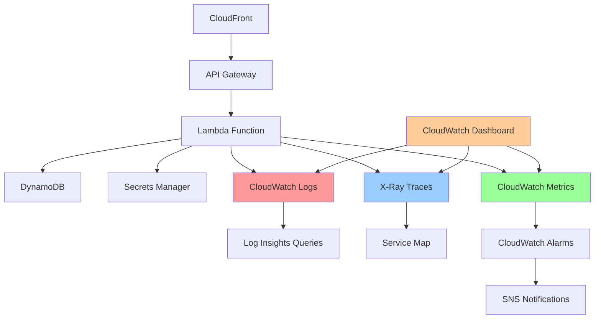

# 🚀 Phase 5: Production Readiness

> **Last Updated**: August 20, 2025

## 🎯 Phase Overview

**Duration**: Week 7-8
**Objective**: Implement production-grade monitoring, structured logging, deployment optimization, and operational excellence patterns. This phase transforms the working application into a production-ready service with comprehensive observability and performance optimization.

## 🏗️ Architecture Approach

Phase 5 implements **production operational excellence** with:

- **CloudWatch structured logging** with correlation IDs and performance metrics
- **X-Ray distributed tracing** for request flow visibility across AWS services
- **CloudWatch custom metrics** for business and technical KPIs
- **CloudWatch Alarms** with SNS notifications for proactive monitoring
- **Lambda performance optimization** including memory tuning and cold start reduction
- **CDK environment-specific deployments** with proper resource tagging
- **Application insights dashboards** for real-time operational visibility

## 📊 Production Features to Implement

### Observability Stack



### Key Metrics and Alarms

- **Response Time P95/P99** - API Gateway and Lambda duration tracking
- **Error Rate** - 4xx/5xx error percentage monitoring
- **Cold Start Frequency** - Lambda initialization performance
- **DynamoDB Throttling** - Read/write capacity monitoring
- **Cache Hit Ratio** - Memory cache effectiveness
- **External API Failures** - NuGet/GitHub provider health

## 🔧 Implementation Steps

### Step 1: Structured Logging Infrastructure

Implement comprehensive logging with correlation tracking:

```csharp
// BadgeSmith.Api/Logging/StructuredLogger.cs
using Microsoft.Extensions.Logging;
using System.Text.Json;

namespace BadgeSmith.Api.Logging;

public interface IStructuredLogger
{
    void LogRequestStart(string correlationId, string method, string path, Dictionary<string, object>? metadata = null);
    void LogRequestEnd(string correlationId, int statusCode, long durationMs, Dictionary<string, object>? metadata = null);
    void LogBusinessEvent(string eventType, string correlationId, Dictionary<string, object> data);
    void LogPerformanceMetric(string metricName, double value, string unit, Dictionary<string, object>? dimensions = null);
    void LogExternalApiCall(string provider, string endpoint, int statusCode, long durationMs, string correlationId);
    void LogCacheOperation(string operation, string key, bool hit, long durationMs, string correlationId);
}

public class StructuredLogger : IStructuredLogger
{
    private readonly ILogger<StructuredLogger> _logger;
    private readonly JsonSerializerOptions _jsonOptions;

    public StructuredLogger(ILogger<StructuredLogger> logger)
    {
        _logger = logger;
        _jsonOptions = new JsonSerializerOptions
        {
            PropertyNamingPolicy = JsonNamingPolicy.CamelCase,
            WriteIndented = false
        };
    }

    public void LogRequestStart(string correlationId, string method, string path, Dictionary<string, object>? metadata = null)
    {
        var logData = new Dictionary<string, object>
        {
            ["event"] = "request_start",
            ["correlationId"] = correlationId,
            ["method"] = method,
            ["path"] = path,
            ["timestamp"] = DateTimeOffset.UtcNow.ToString("O")
        };

        if (metadata != null)
        {
            foreach (var kvp in metadata)
            {
                logData[kvp.Key] = kvp.Value;
            }
        }

        _logger.LogInformation("{LogData}", JsonSerializer.Serialize(logData, _jsonOptions));
    }

    public void LogRequestEnd(string correlationId, int statusCode, long durationMs, Dictionary<string, object>? metadata = null)
    {
        var logData = new Dictionary<string, object>
        {
            ["event"] = "request_end",
            ["correlationId"] = correlationId,
            ["statusCode"] = statusCode,
            ["durationMs"] = durationMs,
            ["timestamp"] = DateTimeOffset.UtcNow.ToString("O")
        };

        if (metadata != null)
        {
            foreach (var kvp in metadata)
            {
                logData[kvp.Key] = kvp.Value;
            }
        }

        var logLevel = statusCode >= 500 ? LogLevel.Error :
                      statusCode >= 400 ? LogLevel.Warning :
                      LogLevel.Information;

        _logger.Log(logLevel, "{LogData}", JsonSerializer.Serialize(logData, _jsonOptions));
    }

    public void LogBusinessEvent(string eventType, string correlationId, Dictionary<string, object> data)
    {
        var logData = new Dictionary<string, object>
        {
            ["event"] = eventType,
            ["correlationId"] = correlationId,
            ["timestamp"] = DateTimeOffset.UtcNow.ToString("O")
        };

        foreach (var kvp in data)
        {
            logData[kvp.Key] = kvp.Value;
        }

        _logger.LogInformation("{LogData}", JsonSerializer.Serialize(logData, _jsonOptions));
    }

    public void LogPerformanceMetric(string metricName, double value, string unit, Dictionary<string, object>? dimensions = null)
    {
        var logData = new Dictionary<string, object>
        {
            ["event"] = "performance_metric",
            ["metricName"] = metricName,
            ["value"] = value,
            ["unit"] = unit,
            ["timestamp"] = DateTimeOffset.UtcNow.ToString("O")
        };

        if (dimensions != null)
        {
            logData["dimensions"] = dimensions;
        }

        _logger.LogInformation("{LogData}", JsonSerializer.Serialize(logData, _jsonOptions));
    }

    public void LogExternalApiCall(string provider, string endpoint, int statusCode, long durationMs, string correlationId)
    {
        var logData = new Dictionary<string, object>
        {
            ["event"] = "external_api_call",
            ["provider"] = provider,
            ["endpoint"] = endpoint,
            ["statusCode"] = statusCode,
            ["durationMs"] = durationMs,
            ["correlationId"] = correlationId,
            ["timestamp"] = DateTimeOffset.UtcNow.ToString("O")
        };

        var logLevel = statusCode >= 500 ? LogLevel.Error :
                      statusCode >= 400 ? LogLevel.Warning :
                      LogLevel.Information;

        _logger.Log(logLevel, "{LogData}", JsonSerializer.Serialize(logData, _jsonOptions));
    }

    public void LogCacheOperation(string operation, string key, bool hit, long durationMs, string correlationId)
    {
        var logData = new Dictionary<string, object>
        {
            ["event"] = "cache_operation",
            ["operation"] = operation,
            ["key"] = key,
            ["hit"] = hit,
            ["durationMs"] = durationMs,
            ["correlationId"] = correlationId,
            ["timestamp"] = DateTimeOffset.UtcNow.ToString("O")
        };

        _logger.LogInformation("{LogData}", JsonSerializer.Serialize(logData, _jsonOptions));
    }
}
```

### Step 2: CloudWatch Custom Metrics Service

Implement CloudWatch metrics for business and technical KPIs:

```csharp
// BadgeSmith.Api/Monitoring/MetricsService.cs
using Amazon.CloudWatch;
using Amazon.CloudWatch.Model;
using Microsoft.Extensions.Logging;

namespace BadgeSmith.Api.Monitoring;

public interface IMetricsService
{
    Task RecordBadgeRequestAsync(string platform, string badgeType, int statusCode, long durationMs);
    Task RecordTestResultIngestionAsync(string platform, bool success, long durationMs);
    Task RecordExternalApiCallAsync(string provider, int statusCode, long durationMs);
    Task RecordCacheOperationAsync(string operation, bool hit, long durationMs);
    Task RecordAuthenticationAttemptAsync(bool success, string reason = "");
}

public class MetricsService : IMetricsService
{
    private readonly IAmazonCloudWatch _cloudWatch;
    private readonly ILogger<MetricsService> _logger;
    private readonly string _namespace;
    private readonly string _environment;

    public MetricsService(IAmazonCloudWatch cloudWatch, ILogger<MetricsService> logger)
    {
        _cloudWatch = cloudWatch;
        _logger = logger;
        _namespace = Environment.GetEnvironmentVariable("CLOUDWATCH_NAMESPACE") ?? "BadgeSmith";
        _environment = Environment.GetEnvironmentVariable("ENVIRONMENT") ?? "Development";
    }

    public async Task RecordBadgeRequestAsync(string platform, string badgeType, int statusCode, long durationMs)
    {
        var metricData = new List<MetricDatum>
        {
            new MetricDatum
            {
                MetricName = "BadgeRequests",
                Value = 1,
                Unit = StandardUnit.Count,
                Timestamp = DateTime.UtcNow,
                Dimensions = new List<Dimension>
                {
                    new Dimension { Name = "Platform", Value = platform },
                    new Dimension { Name = "BadgeType", Value = badgeType },
                    new Dimension { Name = "StatusCode", Value = statusCode.ToString() },
                    new Dimension { Name = "Environment", Value = _environment }
                }
            },
            new MetricDatum
            {
                MetricName = "BadgeRequestDuration",
                Value = durationMs,
                Unit = StandardUnit.Milliseconds,
                Timestamp = DateTime.UtcNow,
                Dimensions = new List<Dimension>
                {
                    new Dimension { Name = "Platform", Value = platform },
                    new Dimension { Name = "BadgeType", Value = badgeType },
                    new Dimension { Name = "Environment", Value = _environment }
                }
            }
        };

        await PublishMetricsAsync(metricData);
    }

    public async Task RecordTestResultIngestionAsync(string platform, bool success, long durationMs)
    {
        var metricData = new List<MetricDatum>
        {
            new MetricDatum
            {
                MetricName = "TestResultIngestions",
                Value = 1,
                Unit = StandardUnit.Count,
                Timestamp = DateTime.UtcNow,
                Dimensions = new List<Dimension>
                {
                    new Dimension { Name = "Platform", Value = platform },
                    new Dimension { Name = "Success", Value = success.ToString() },
                    new Dimension { Name = "Environment", Value = _environment }
                }
            },
            new MetricDatum
            {
                MetricName = "TestResultIngestionDuration",
                Value = durationMs,
                Unit = StandardUnit.Milliseconds,
                Timestamp = DateTime.UtcNow,
                Dimensions = new List<Dimension>
                {
                    new Dimension { Name = "Platform", Value = platform },
                    new Dimension { Name = "Environment", Value = _environment }
                }
            }
        };

        await PublishMetricsAsync(metricData);
    }

    public async Task RecordExternalApiCallAsync(string provider, int statusCode, long durationMs)
    {
        var metricData = new List<MetricDatum>
        {
            new MetricDatum
            {
                MetricName = "ExternalApiCalls",
                Value = 1,
                Unit = StandardUnit.Count,
                Timestamp = DateTime.UtcNow,
                Dimensions = new List<Dimension>
                {
                    new Dimension { Name = "Provider", Value = provider },
                    new Dimension { Name = "StatusCode", Value = statusCode.ToString() },
                    new Dimension { Name = "Environment", Value = _environment }
                }
            },
            new MetricDatum
            {
                MetricName = "ExternalApiDuration",
                Value = durationMs,
                Unit = StandardUnit.Milliseconds,
                Timestamp = DateTime.UtcNow,
                Dimensions = new List<Dimension>
                {
                    new Dimension { Name = "Provider", Value = provider },
                    new Dimension { Name = "Environment", Value = _environment }
                }
            }
        };

        await PublishMetricsAsync(metricData);
    }

    public async Task RecordCacheOperationAsync(string operation, bool hit, long durationMs)
    {
        var metricData = new List<MetricDatum>
        {
            new MetricDatum
            {
                MetricName = "CacheOperations",
                Value = 1,
                Unit = StandardUnit.Count,
                Timestamp = DateTime.UtcNow,
                Dimensions = new List<Dimension>
                {
                    new Dimension { Name = "Operation", Value = operation },
                    new Dimension { Name = "Result", Value = hit ? "Hit" : "Miss" },
                    new Dimension { Name = "Environment", Value = _environment }
                }
            },
            new MetricDatum
            {
                MetricName = "CacheOperationDuration",
                Value = durationMs,
                Unit = StandardUnit.Milliseconds,
                Timestamp = DateTime.UtcNow,
                Dimensions = new List<Dimension>
                {
                    new Dimension { Name = "Operation", Value = operation },
                    new Dimension { Name = "Environment", Value = _environment }
                }
            }
        };

        if (operation == "Get")
        {
            metricData.Add(new MetricDatum
            {
                MetricName = "CacheHitRate",
                Value = hit ? 100 : 0,
                Unit = StandardUnit.Percent,
                Timestamp = DateTime.UtcNow,
                Dimensions = new List<Dimension>
                {
                    new Dimension { Name = "Environment", Value = _environment }
                }
            });
        }

        await PublishMetricsAsync(metricData);
    }

    public async Task RecordAuthenticationAttemptAsync(bool success, string reason = "")
    {
        var metricData = new List<MetricDatum>
        {
            new MetricDatum
            {
                MetricName = "AuthenticationAttempts",
                Value = 1,
                Unit = StandardUnit.Count,
                Timestamp = DateTime.UtcNow,
                Dimensions = new List<Dimension>
                {
                    new Dimension { Name = "Success", Value = success.ToString() },
                    new Dimension { Name = "Reason", Value = reason },
                    new Dimension { Name = "Environment", Value = _environment }
                }
            }
        };

        await PublishMetricsAsync(metricData);
    }

    private async Task PublishMetricsAsync(List<MetricDatum> metricData)
    {
        try
        {
            await _cloudWatch.PutMetricDataAsync(new PutMetricDataRequest
            {
                Namespace = _namespace,
                MetricData = metricData
            });

            _logger.LogDebug("Published {Count} metrics to CloudWatch", metricData.Count);
        }
        catch (Exception ex)
        {
            _logger.LogError(ex, "Failed to publish metrics to CloudWatch");
            // Don't rethrow - metrics failures shouldn't break the application
        }
    }
}
```

### Step 3: Request Correlation and Middleware

Implement request correlation tracking:

```csharp
// BadgeSmith.Api/Middleware/RequestTrackingMiddleware.cs
using BadgeSmith.Api.Logging;
using BadgeSmith.Api.Monitoring;
using System.Diagnostics;

namespace BadgeSmith.Api.Middleware;

public static class RequestTrackingMiddleware
{
    public static async Task<APIGatewayHttpApiV2ProxyResponse> TrackRequestAsync(
        APIGatewayHttpApiV2ProxyRequest request,
        IServiceProvider services,
        Func<APIGatewayHttpApiV2ProxyRequest, IServiceProvider, Task<APIGatewayHttpApiV2ProxyResponse>> next)
    {
        var structuredLogger = services.GetRequiredService<IStructuredLogger>();
        var metricsService = services.GetRequiredService<IMetricsService>();

        // Generate correlation ID
        var correlationId = request.Headers?.GetValueOrDefault("X-Correlation-ID") ?? Guid.NewGuid().ToString();

        // Add correlation ID to all services that support it
        var stopwatch = Stopwatch.StartNew();

        try
        {
            // Log request start
            var requestMetadata = new Dictionary<string, object>
            {
                ["userAgent"] = request.Headers?.GetValueOrDefault("User-Agent") ?? "",
                ["sourceIp"] = request.RequestContext?.Http?.SourceIp ?? "",
                ["requestId"] = request.RequestContext?.RequestId ?? ""
            };

            structuredLogger.LogRequestStart(correlationId,
                request.RequestContext?.Http?.Method ?? "",
                request.RawPath ?? "",
                requestMetadata);

            // Execute the request
            var response = await next(request, services);

            stopwatch.Stop();

            // Log request end
            var responseMetadata = new Dictionary<string, object>
            {
                ["responseSize"] = response.Body?.Length ?? 0
            };

            structuredLogger.LogRequestEnd(correlationId, response.StatusCode, stopwatch.ElapsedMilliseconds, responseMetadata);

            // Add correlation ID to response headers
            response.Headers ??= new Dictionary<string, string>();
            response.Headers["X-Correlation-ID"] = correlationId;

            // Record metrics based on response
            await RecordRequestMetricsAsync(request, response, stopwatch.ElapsedMilliseconds, metricsService);

            return response;
        }
        catch (Exception ex)
        {
            stopwatch.Stop();

            structuredLogger.LogRequestEnd(correlationId, 500, stopwatch.ElapsedMilliseconds, new Dictionary<string, object>
            {
                ["error"] = ex.Message,
                ["exceptionType"] = ex.GetType().Name
            });

            // Record error metrics
            await RecordRequestMetricsAsync(request, null, stopwatch.ElapsedMilliseconds, metricsService);

            throw;
        }
    }

    private static async Task RecordRequestMetricsAsync(
        APIGatewayHttpApiV2ProxyRequest request,
        APIGatewayHttpApiV2ProxyResponse? response,
        long durationMs,
        IMetricsService metricsService)
    {
        var path = request.RawPath ?? "";
        var statusCode = response?.StatusCode ?? 500;

        // Determine badge type and platform from path
        if (path.StartsWith("/badges/packages/"))
        {
            var pathParts = path.Split('/');
            var platform = pathParts.Length > 3 ? pathParts[3] : "unknown";
            await metricsService.RecordBadgeRequestAsync(platform, "package", statusCode, durationMs);
        }
        else if (path.StartsWith("/badges/tests/"))
        {
            var pathParts = path.Split('/');
            var platform = pathParts.Length > 3 ? pathParts[3] : "unknown";
            await metricsService.RecordBadgeRequestAsync(platform, "test", statusCode, durationMs);
        }
        else if (path.StartsWith("/tests/results"))
        {
            // Extract platform from request body if needed, default to "unknown"
            await metricsService.RecordTestResultIngestionAsync("unknown", statusCode < 400, durationMs);
        }
    }
}
```

### Step 4: Enhanced CDK Infrastructure with Monitoring

Extend the CDK stack with comprehensive monitoring:

```csharp
// Update BadgeSmith.Host/BadgeSmithInfrastructureStack.cs
using Amazon.CDK.AWS.CloudWatch;
using Amazon.CDK.AWS.SNS;
using Amazon.CDK.AWS.SNS.Subscriptions;
using Amazon.CDK.AWS.Logs;

public class BadgeSmithInfrastructureStack : Stack
{
    // ... existing properties ...
    public Topic AlertsTopic { get; private set; }
    public Dashboard MonitoringDashboard { get; private set; }

    public BadgeSmithInfrastructureStack(Construct scope, string id, IStackProps? props = null)
        : base(scope, id, props)
    {
        // ... existing table and role creation ...

        // Create monitoring infrastructure
        AlertsTopic = CreateAlertsTopic();
        var alarms = CreateCloudWatchAlarms();
        MonitoringDashboard = CreateMonitoringDashboard();
    }

    private Topic CreateAlertsTopic()
    {
        var topic = new Topic(this, "BadgeSmithAlerts", new TopicProps
        {
            DisplayName = "BadgeSmith Alerts",
            TopicName = "badge-smith-alerts"
        });

        // Add email subscription if provided
        var alertEmail = this.Node.TryGetContext("alertEmail") as string;
        if (!string.IsNullOrEmpty(alertEmail))
        {
            topic.AddSubscription(new EmailSubscription(alertEmail));
        }

        return topic;
    }

    private List<Alarm> CreateCloudWatchAlarms()
    {
        var alarms = new List<Alarm>();

        // High error rate alarm
        var errorRateAlarm = new Alarm(this, "HighErrorRate", new AlarmProps
        {
            AlarmName = "BadgeSmith-HighErrorRate",
            AlarmDescription = "Badge service error rate is above 5%",
            MetricName = "4XXError",
            Namespace = "AWS/ApiGateway",
            Statistic = "Sum",
            Period = Duration.Minutes(5),
            EvaluationPeriods = 2,
            Threshold = 5,
            ComparisonOperator = ComparisonOperator.GREATER_THAN_THRESHOLD,
            TreatMissingData = TreatMissingData.NOT_BREACHING
        });

        errorRateAlarm.AddAlarmAction(new SnsAction(AlertsTopic));
        alarms.Add(errorRateAlarm);

        // High response time alarm
        var latencyAlarm = new Alarm(this, "HighLatency", new AlarmProps
        {
            AlarmName = "BadgeSmith-HighLatency",
            AlarmDescription = "Badge service P95 latency is above 2 seconds",
            MetricName = "Latency",
            Namespace = "AWS/ApiGateway",
            Statistic = "Average",
            Period = Duration.Minutes(5),
            EvaluationPeriods = 2,
            Threshold = 2000,
            ComparisonOperator = ComparisonOperator.GREATER_THAN_THRESHOLD,
            TreatMissingData = TreatMissingData.NOT_BREACHING
        });

        latencyAlarm.AddAlarmAction(new SnsAction(AlertsTopic));
        alarms.Add(latencyAlarm);

        // Lambda error rate alarm
        var lambdaErrorAlarm = new Alarm(this, "LambdaErrors", new AlarmProps
        {
            AlarmName = "BadgeSmith-LambdaErrors",
            AlarmDescription = "Lambda function error rate is above 1%",
            MetricName = "Errors",
            Namespace = "AWS/Lambda",
            Statistic = "Sum",
            Period = Duration.Minutes(5),
            EvaluationPeriods = 2,
            Threshold = 5,
            ComparisonOperator = ComparisonOperator.GREATER_THAN_THRESHOLD,
            TreatMissingData = TreatMissingData.NOT_BREACHING
        });

        lambdaErrorAlarm.AddAlarmAction(new SnsAction(AlertsTopic));
        alarms.Add(lambdaErrorAlarm);

        // DynamoDB throttling alarm
        var dynamoThrottleAlarm = new Alarm(this, "DynamoDBThrottling", new AlarmProps
        {
            AlarmName = "BadgeSmith-DynamoDBThrottling",
            AlarmDescription = "DynamoDB requests are being throttled",
            MetricName = "ThrottledRequests",
            Namespace = "AWS/DynamoDB",
            Statistic = "Sum",
            Period = Duration.Minutes(5),
            EvaluationPeriods = 1,
            Threshold = 0,
            ComparisonOperator = ComparisonOperator.GREATER_THAN_THRESHOLD,
            TreatMissingData = TreatMissingData.NOT_BREACHING
        });

        dynamoThrottleAlarm.AddAlarmAction(new SnsAction(AlertsTopic));
        alarms.Add(dynamoThrottleAlarm);

        return alarms;
    }

    private Dashboard CreateMonitoringDashboard()
    {
        var dashboard = new Dashboard(this, "BadgeSmithDashboard", new DashboardProps
        {
            DashboardName = "BadgeSmith-Operations",
            PeriodOverride = PeriodOverride.INHERIT
        });

        // API Gateway metrics row
        dashboard.AddWidgets(
            new GraphWidget(new GraphWidgetProps
            {
                Title = "API Gateway Requests",
                Width = 12,
                Height = 6,
                Left = new[]
                {
                    new Metric(new MetricProps
                    {
                        Namespace = "AWS/ApiGateway",
                        MetricName = "Count",
                        Statistic = "Sum",
                        Period = Duration.Minutes(5)
                    })
                }
            }),
            new GraphWidget(new GraphWidgetProps
            {
                Title = "API Gateway Latency",
                Width = 12,
                Height = 6,
                Left = new[]
                {
                    new Metric(new MetricProps
                    {
                        Namespace = "AWS/ApiGateway",
                        MetricName = "Latency",
                        Statistic = "Average",
                        Period = Duration.Minutes(5)
                    })
                }
            })
        );

        // Lambda metrics row
        dashboard.AddWidgets(
            new GraphWidget(new GraphWidgetProps
            {
                Title = "Lambda Duration",
                Width = 8,
                Height = 6,
                Left = new[]
                {
                    new Metric(new MetricProps
                    {
                        Namespace = "AWS/Lambda",
                        MetricName = "Duration",
                        Statistic = "Average",
                        Period = Duration.Minutes(5)
                    })
                }
            }),
            new GraphWidget(new GraphWidgetProps
            {
                Title = "Lambda Errors",
                Width = 8,
                Height = 6,
                Left = new[]
                {
                    new Metric(new MetricProps
                    {
                        Namespace = "AWS/Lambda",
                        MetricName = "Errors",
                        Statistic = "Sum",
                        Period = Duration.Minutes(5)
                    })
                }
            }),
            new GraphWidget(new GraphWidgetProps
            {
                Title = "Lambda Invocations",
                Width = 8,
                Height = 6,
                Left = new[]
                {
                    new Metric(new MetricProps
                    {
                        Namespace = "AWS/Lambda",
                        MetricName = "Invocations",
                        Statistic = "Sum",
                        Period = Duration.Minutes(5)
                    })
                }
            })
        );

        // Custom business metrics row
        dashboard.AddWidgets(
            new GraphWidget(new GraphWidgetProps
            {
                Title = "Badge Requests by Platform",
                Width = 12,
                Height = 6,
                Left = new[]
                {
                    new Metric(new MetricProps
                    {
                        Namespace = "BadgeSmith",
                        MetricName = "BadgeRequests",
                        Statistic = "Sum",
                        Period = Duration.Minutes(5)
                    })
                }
            }),
            new GraphWidget(new GraphWidgetProps
            {
                Title = "Cache Hit Rate",
                Width = 12,
                Height = 6,
                Left = new[]
                {
                    new Metric(new MetricProps
                    {
                        Namespace = "BadgeSmith",
                        MetricName = "CacheHitRate",
                        Statistic = "Average",
                        Period = Duration.Minutes(5)
                    })
                }
            })
        );

        return dashboard;
    }

    // Add X-Ray tracing role permissions
    private void AddXRayPermissions(Role role)
    {
        role.AddToPolicy(new PolicyStatement(new PolicyStatementProps
        {
            Effect = Effect.ALLOW,
            Actions = new[]
            {
                "xray:PutTraceSegments",
                "xray:PutTelemetryRecords"
            },
            Resources = new[] { "*" }
        }));
    }

    // Add CloudWatch metrics permissions
    private void AddCloudWatchPermissions(Role role)
    {
        role.AddToPolicy(new PolicyStatement(new PolicyStatementProps
        {
            Effect = Effect.ALLOW,
            Actions = new[]
            {
                "cloudwatch:PutMetricData"
            },
            Resources = new[] { "*" }
        }));
    }
}
```

### Step 5: Lambda Performance Optimization

Optimize Lambda configuration for production:

```csharp
// Update BadgeSmith.Api/aws-lambda-tools-defaults.json
{
  "profile": "default",
  "region": "us-east-1",
  "configuration": "Release",
  "s3-bucket": "badge-smith-deployments",
  "s3-prefix": "lambda-deployments/",
  "stack-name": "BadgeSmith",
  "template": "serverless.template",
  "template-parameters": {
    "MemorySize": "512",
    "Timeout": "30",
    "Environment": "Production",
    "TracingConfig": "Active",
    "ReservedConcurrency": "100"
  },
  "environment-variables": {
    "ASPNETCORE_ENVIRONMENT": "Production",
    "AWS_XRAY_TRACING_NAME": "BadgeSmith",
    "CLOUDWATCH_NAMESPACE": "BadgeSmith/Production",
    "POWERTOOLS_SERVICE_NAME": "BadgeSmith",
    "POWERTOOLS_METRICS_NAMESPACE": "BadgeSmith"
  }
}

// Update BadgeSmith.Api/serverless.template
{
  "AWSTemplateFormatVersion": "2010-09-09",
  "Transform": "AWS::Serverless-2016-10-31",
  "Description": "BadgeSmith serverless application",
  "Parameters": {
    "MemorySize": {
      "Type": "Number",
      "Default": 512,
      "Description": "Lambda function memory size"
    },
    "Timeout": {
      "Type": "Number",
      "Default": 30,
      "Description": "Lambda function timeout in seconds"
    },
    "ReservedConcurrency": {
      "Type": "Number",
      "Default": 100,
      "Description": "Reserved concurrency for Lambda function"
    },
    "TracingConfig": {
      "Type": "String",
      "Default": "Active",
      "AllowedValues": ["Active", "PassThrough"],
      "Description": "X-Ray tracing configuration"
    },
    "Environment": {
      "Type": "String",
      "Default": "Development",
      "Description": "Deployment environment"
    }
  },
  "Resources": {
    "BadgeSmithFunction": {
      "Type": "AWS::Serverless::Function",
      "Properties": {
        "CodeUri": ".",
        "Handler": "BadgeSmith.Api::BadgeSmith.Api.LambdaEntryPoint::FunctionHandlerAsync",
        "Runtime": "dotnet8",
        "MemorySize": { "Ref": "MemorySize" },
        "Timeout": { "Ref": "Timeout" },
        "ReservedConcurrencyLimit": { "Ref": "ReservedConcurrency" },
        "Tracing": { "Ref": "TracingConfig" },
        "Environment": {
          "Variables": {
            "ASPNETCORE_ENVIRONMENT": { "Ref": "Environment" },
            "AWS_XRAY_TRACING_NAME": "BadgeSmith",
            "CLOUDWATCH_NAMESPACE": { "Fn::Sub": "BadgeSmith/${Environment}" },
            "ENVIRONMENT": { "Ref": "Environment" }
          }
        },
        "Policies": [
          "AWSLambdaBasicExecutionRole",
          "AWSXRayDaemonWriteAccess",
          {
            "Version": "2012-10-17",
            "Statement": [
              {
                "Effect": "Allow",
                "Action": [
                  "dynamodb:GetItem",
                  "dynamodb:PutItem",
                  "dynamodb:UpdateItem",
                  "dynamodb:DeleteItem",
                  "dynamodb:Query",
                  "dynamodb:Scan",
                  "dynamodb:TransactWriteItems",
                  "dynamodb:TransactGetItems"
                ],
                "Resource": [
                  { "Fn::Sub": "arn:aws:dynamodb:${AWS::Region}:${AWS::AccountId}:table/badge-*" },
                  { "Fn::Sub": "arn:aws:dynamodb:${AWS::Region}:${AWS::AccountId}:table/badge-*/index/*" }
                ]
              },
              {
                "Effect": "Allow",
                "Action": [
                  "secretsmanager:GetSecretValue"
                ],
                "Resource": [
                  { "Fn::Sub": "arn:aws:secretsmanager:${AWS::Region}:${AWS::AccountId}:secret:badge-smith/*" }
                ]
              },
              {
                "Effect": "Allow",
                "Action": [
                  "cloudwatch:PutMetricData"
                ],
                "Resource": "*"
              }
            ]
          }
        ],
        "Events": {
          "ApiGateway": {
            "Type": "HttpApi",
            "Properties": {
              "ApiId": { "Ref": "BadgeSmithApi" },
              "Method": "ANY",
              "Path": "/{proxy+}"
            }
          }
        }
      }
    },
    "BadgeSmithApi": {
      "Type": "AWS::Serverless::HttpApi",
      "Properties": {
        "Description": "BadgeSmith HTTP API",
        "CorsConfiguration": {
          "AllowOrigins": ["*"],
          "AllowMethods": ["GET", "POST", "OPTIONS"],
          "AllowHeaders": ["*"],
          "MaxAge": 86400
        },
        "AccessLogSettings": {
          "DestinationArn": { "Fn::GetAtt": ["ApiGatewayLogGroup", "Arn"] },
          "Format": "$requestId $requestTime $httpMethod $routeKey $status $responseLength $requestTime"
        }
      }
    },
    "ApiGatewayLogGroup": {
      "Type": "AWS::Logs::LogGroup",
      "Properties": {
        "LogGroupName": { "Fn::Sub": "/aws/apigateway/BadgeSmith-${Environment}" },
        "RetentionInDays": 30
      }
    }
  },
  "Outputs": {
    "ApiUrl": {
      "Description": "HTTP API Gateway endpoint URL",
      "Value": { "Fn::Sub": "https://${BadgeSmithApi}.execute-api.${AWS::Region}.amazonaws.com/" }
    },
    "FunctionArn": {
      "Description": "Lambda Function ARN",
      "Value": { "Fn::GetAtt": ["BadgeSmithFunction", "Arn"] }
    }
  }
}
```

### Step 6: Enhanced Service Registration with Monitoring

```csharp
// Update BadgeSmith.Api/Extensions/ServiceCollectionExtensions.cs
public static IServiceCollection AddBadgeSmithServices(this IServiceCollection services)
{
    // ... existing service registrations ...

    // Production monitoring services
    services.AddSingleton<IStructuredLogger, StructuredLogger>();
    services.AddSingleton<IMetricsService, MetricsService>();

    // AWS monitoring services
    services.AddAWSService<IAmazonCloudWatch>();
    services.AddAWSService<IAmazonXRay>();

    // Configure HTTP clients with proper timeouts and retry policies
    services.AddHttpClient<NuGetProvider>(client =>
    {
        client.BaseAddress = new Uri("https://api.nuget.org/");
        client.Timeout = TimeSpan.FromSeconds(10); // Reduced for better performance
        client.DefaultRequestHeaders.Add("User-Agent", "BadgeSmith/1.0");
    })
    .AddPolicyHandler(GetRetryPolicy())
    .AddPolicyHandler(GetCircuitBreakerPolicy());

    services.AddHttpClient<GitHubProvider>(client =>
    {
        client.BaseAddress = new Uri("https://api.github.com/");
        client.Timeout = TimeSpan.FromSeconds(10);
        client.DefaultRequestHeaders.Add("User-Agent", "BadgeSmith/1.0");
        client.DefaultRequestHeaders.Add("Accept", "application/vnd.github.v3+json");
    })
    .AddPolicyHandler(GetRetryPolicy())
    .AddPolicyHandler(GetCircuitBreakerPolicy());

    return services;
}

private static IAsyncPolicy<HttpResponseMessage> GetRetryPolicy()
{
    return Policy
        .HandleResult<HttpResponseMessage>(r => !r.IsSuccessStatusCode)
        .Or<HttpRequestException>()
        .WaitAndRetryAsync(
            retryCount: 3,
            sleepDurationProvider: retryAttempt => TimeSpan.FromSeconds(Math.Pow(2, retryAttempt)),
            onRetry: (outcome, timespan, retryCount, context) =>
            {
                var logger = context.GetLogger();
                logger?.LogWarning("Retry attempt {RetryCount} after {Delay}ms for {OperationKey}",
                    retryCount, timespan.TotalMilliseconds, context.OperationKey);
            });
}

private static IAsyncPolicy<HttpResponseMessage> GetCircuitBreakerPolicy()
{
    return Policy
        .HandleResult<HttpResponseMessage>(r => !r.IsSuccessStatusCode)
        .Or<HttpRequestException>()
        .CircuitBreakerAsync(
            exceptionsAllowedBeforeBreaking: 5,
            durationOfBreak: TimeSpan.FromSeconds(30),
            onBreak: (exception, timespan) =>
            {
                // Log circuit breaker opened
            },
            onReset: () =>
            {
                // Log circuit breaker closed
            });
}
```

### Step 7: Update Lambda Entry Point with Middleware

```csharp
// Update BadgeSmith.Api/LambdaEntryPoint.cs
using BadgeSmith.Api.Middleware;

namespace BadgeSmith.Api;

public class LambdaEntryPoint : Amazon.Lambda.AspNetCoreServer.APIGatewayHttpApiV2ProxyFunction
{
    protected override void Init(IHostBuilder builder)
    {
        builder
            .ConfigureServices((context, services) =>
            {
                services.AddBadgeSmithServices();
            })
            .ConfigureLogging(logging =>
            {
                logging.ClearProviders();
                logging.AddConsole();
                logging.AddAWSProvider();

                // Set log levels based on environment
                var environment = Environment.GetEnvironmentVariable("ASPNETCORE_ENVIRONMENT");
                if (environment == "Production")
                {
                    logging.SetMinimumLevel(LogLevel.Information);
                }
                else
                {
                    logging.SetMinimumLevel(LogLevel.Debug);
                }
            });
    }

    public override async Task<APIGatewayHttpApiV2ProxyResponse> FunctionHandlerAsync(
        APIGatewayHttpApiV2ProxyRequest request,
        ILambdaContext context)
    {
        var serviceProvider = CreateServiceProvider();

        // Wrap request handling with tracking middleware
        return await RequestTrackingMiddleware.TrackRequestAsync(
            request,
            serviceProvider,
            async (req, services) => await Router.HandleAsync(req, services));
    }

    private IServiceProvider CreateServiceProvider()
    {
        var services = new ServiceCollection();
        services.AddBadgeSmithServices();
        return services.BuildServiceProvider();
    }
}
```

### Step 8: CloudWatch Log Insights Queries

Create saved queries for operational insights:

```sql
-- API Performance Analysis
fields @timestamp, correlationId, durationMs, statusCode, path
| filter event = "request_end"
| stats avg(durationMs) as avgDuration, max(durationMs) as maxDuration, count(*) as requestCount by bin(5m)
| sort @timestamp desc

-- Error Analysis
fields @timestamp, correlationId, statusCode, path, error
| filter statusCode >= 400
| stats count(*) as errorCount by statusCode, path
| sort errorCount desc

-- Cache Performance
fields @timestamp, correlationId, operation, hit, durationMs
| filter event = "cache_operation"
| stats avg(durationMs) as avgDuration, sum(hit) / count(*) * 100 as hitRate by bin(5m)
| sort @timestamp desc

-- External API Performance
fields @timestamp, provider, statusCode, durationMs
| filter event = "external_api_call"
| stats avg(durationMs) as avgDuration, count(*) as callCount by provider, bin(5m)
| sort @timestamp desc

-- Authentication Failures
fields @timestamp, correlationId, statusCode, error
| filter event = "request_end" and statusCode = 401
| stats count(*) as authFailures by bin(5m)
| sort @timestamp desc

-- Business Metrics
fields @timestamp, event, platform, badgeType
| filter event = "business_event"
| stats count(*) as events by platform, badgeType, bin(1h)
| sort @timestamp desc
```

## ✅ Success Criteria

### Monitoring Success Criteria

- ✅ **CloudWatch structured logging** captures all request flows with correlation IDs
- ✅ **Custom metrics** track badge requests, test ingestions, and cache performance
- ✅ **CloudWatch alarms** trigger notifications for high error rates and latency
- ✅ **X-Ray tracing** provides end-to-end request visibility
- ✅ **Operational dashboard** displays real-time system health and performance

### Performance Success Criteria

- ✅ **Response time P95** under 1 second for cached requests
- ✅ **Response time P95** under 3 seconds for uncached requests
- ✅ **Cold start frequency** less than 5% of total requests
- ✅ **Cache hit ratio** above 80% for package badges
- ✅ **Error rate** below 0.1% for successful deployments

### Operational Success Criteria

- ✅ **Log retention** configured appropriately for compliance and cost
- ✅ **Alert routing** delivers notifications to appropriate channels
- ✅ **Metric-based scaling** handles traffic variations automatically
- ✅ **Circuit breaker patterns** prevent cascading failures from external APIs
- ✅ **Correlation tracking** enables efficient debugging and troubleshooting

## 🧪 Testing Production Readiness

### Load Testing Script

```powershell
# PowerShell load testing script
param(
    [string]$BaseUrl = "https://your-api-gateway-url.execute-api.us-east-1.amazonaws.com",
    [int]$ConcurrentRequests = 10,
    [int]$DurationSeconds = 60
)

$endpoints = @(
    "/badges/packages/nuget/Microsoft.Extensions.Logging/latest",
    "/badges/packages/github/microsoft/dotnet/releases",
    "/badges/tests/github/test-org/test-repo/main",
    "/health"
)

$jobs = @()

Write-Host "Starting load test with $ConcurrentRequests concurrent requests for $DurationSeconds seconds"

for ($i = 0; $i -lt $ConcurrentRequests; $i++) {
    $jobs += Start-Job -ScriptBlock {
        param($BaseUrl, $Endpoints, $DurationSeconds)

        $endTime = (Get-Date).AddSeconds($DurationSeconds)
        $requestCount = 0
        $errorCount = 0

        while ((Get-Date) -lt $endTime) {
            $endpoint = $Endpoints | Get-Random
            $url = "$BaseUrl$endpoint"

            try {
                $response = Invoke-WebRequest -Uri $url -Method GET -TimeoutSec 10
                $requestCount++

                if ($response.StatusCode -ge 400) {
                    $errorCount++
                }
            }
            catch {
                $errorCount++
            }

            Start-Sleep -Milliseconds 100
        }

        return @{
            RequestCount = $requestCount
            ErrorCount = $errorCount
        }
    } -ArgumentList $BaseUrl, $endpoints, $DurationSeconds
}

# Wait for all jobs to complete
$results = $jobs | Receive-Job -Wait

# Calculate totals
$totalRequests = ($results | Measure-Object -Property RequestCount -Sum).Sum
$totalErrors = ($results | Measure-Object -Property ErrorCount -Sum).Sum
$errorRate = if ($totalRequests -gt 0) { ($totalErrors / $totalRequests) * 100 } else { 0 }

Write-Host "Load test completed:"
Write-Host "  Total requests: $totalRequests"
Write-Host "  Total errors: $totalErrors"
Write-Host "  Error rate: $($errorRate.ToString('F2'))%"
Write-Host "  Requests per second: $($totalRequests / $DurationSeconds)"

# Clean up jobs
$jobs | Remove-Job
```

### Monitoring Validation

```powershell
# Validate CloudWatch metrics are being published
aws cloudwatch get-metric-statistics --namespace "BadgeSmith" --metric-name "BadgeRequests" --start-time (Get-Date).AddHours(-1).ToString("yyyy-MM-ddTHH:mm:ssZ") --end-time (Get-Date).ToString("yyyy-MM-ddTHH:mm:ssZ") --period 300 --statistics Sum

# Check alarm states
aws cloudwatch describe-alarms --alarm-names "BadgeSmith-HighErrorRate" "BadgeSmith-HighLatency"

# Validate X-Ray traces
aws xray get-trace-summaries --time-range-type TimeRangeByStartTime --start-time (Get-Date).AddHours(-1).ToString("yyyy-MM-ddTHH:mm:ssZ") --end-time (Get-Date).ToString("yyyy-MM-ddTHH:mm:ssZ")
```

## 🔄 Next Steps

After Phase 5 completion, proceed to:

- **[Phase 6: Migration & Documentation](../03-implementation/Phase-6-migration-documentation.md)** - Complete migration strategy and comprehensive API documentation

## 🔗 Related Documentation

- **[System Architecture](../02-architecture/01-system-architecture.md)** - Overall system design and monitoring integration
- **[Requirements](../01-foundation/02-requirements.md)** - Performance and operational requirements (NFR-1, NFR-2, NFR-3)
- **[Phase 4: Authentication](../03-implementation/Phase-4-authentication.md)** - Security foundation this phase builds upon

---

> 💡 **Production Tip**: Start with conservative alarm thresholds and adjust based on actual traffic patterns. Monitor CloudWatch costs and optimize log retention policies for your compliance requirements.
